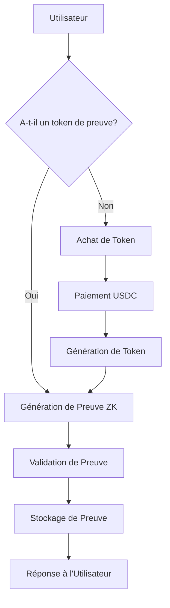

# Documentation Technique de GeoPrivacy

## Architecture Système

### Composants Principaux
- **Smart Contract**: `GeoPrivacyPayment.sol`
- **Service de Paiement**: `PaymentService.ts`
- **Service de Preuve de Localisation**: `LocationProofService.ts`
- **Générateur de Preuves Zero-Knowledge**: `ZeroKnowledgeProofGenerator.ts`

## Flux de Génération de Preuve



## Détails Techniques des Contrats

### GeoPrivacyPayment.sol

#### Fonctionnalités Principales
- Achat de tokens de preuve
- Validation de tokens
- Gestion des paiements USDC
- Contrôle d'accès

#### Paramètres Clés
- **Coût du Token**: 0.5 USDC
- **Limite de Tokens par Utilisateur**: 10
- **Token USDC**: Adresse configurable

### Sécurité et Optimisations

#### Mécanismes de Sécurité
- Vérification des autorisations
- Validation des transferts de tokens
- Limitation du nombre de tokens
- Gestion des remboursements

#### Optimisations de Gaz
- Utilisation de `constant`
- Opérations de stockage minimales
- Vérifications efficaces

## Intégration Blockchain

### Réseaux Supportés
- OP Sepolia (Optimism Testnet)
- Préparation pour mainnet Optimism

### Dépendances
- ethers.js
- OpenZeppelin Contracts
- Hardhat

## Configuration et Déploiement

### Variables d'Environnement Requises
- `OP_SEPOLIA_RPC_URL`: Endpoint RPC
- `USDC_TOKEN_ADDRESS`: Adresse du token USDC
- `PRIVATE_KEY`: Clé de déploiement
- `OPTIMISM_ETHERSCAN_API_KEY`: Clé Etherscan

### Étapes de Déploiement
1. Compiler les contrats
2. Configurer l'environnement
3. Déployer sur OP Sepolia
4. Vérifier sur Etherscan

## Gestion des Erreurs

### Types d'Erreurs
- Erreurs de Paiement
- Erreurs de Validation
- Erreurs de Génération de Preuve

### Stratégie de Gestion
- Remontée d'erreurs explicites
- Logs détaillés
- Mécanismes de reprise

## Performance et Scalabilité

### Limitations Actuelles
- 10 tokens max par utilisateur
- Coût fixe de 0.5 USDC
- Dépendant des performances d'Optimism

### Axes d'Amélioration
- Mise à l'échelle dynamique
- Optimisation des coûts
- Support multi-réseau

## Scripts Utilitaires

### Informations du Contrat
```bash
npm run contract:info
```
- Génère des informations détaillées sur le contrat
- Stocke les métadonnées dans `deployments/contract-info.json`

### Estimation des Coûts de Gaz
```bash
npm run contract:gas-estimate
```
- Estime les coûts de déploiement et de transaction
- Génère un rapport dans `deployments/gas-estimations.json`

## Roadmap Technique

### Court Terme
- Stabilisation du MVP
- Tests approfondis
- Audit de sécurité

### Moyen Terme
- Support multi-réseau
- Intégration de plus de circuits ZK
- Optimisation des coûts

### Long Terme
- Décentralisation accrue
- Modèle économique avancé
- Expansion des cas d'usage
